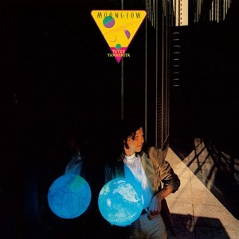

# Quentin Lintz

Software engineer and engineering leader, currently Tech Lead Manager at [Calendly](https://calendly.com/). Most of my time goes into thoughtful engineering, growing the people around me, and building teams I'd want to be on.

Outside of work I'm usually reading, playing guitar, or lifting. My listening lately leans heavily on Japanese City Pop and kayōkyoku.

[LinkedIn](https://www.linkedin.com/in/quentinlintz/) · [Goodreads](https://www.goodreads.com/user/show/160841838)

### Currently Exploring

- Learning about database replication
- Practicing the solo to "Asayake" by Casiopea for my city pop band.

### Currently Reading

<!-- GOODREADS-CURRENTLY-READING:START -->
- [Designing Data\-Intensive Applications: The Big Ideas Behind Reliable, Scalable, and Maintainable Systems](https://www.goodreads.com/book/show/248156714), Martin Kleppmann
- [The Sea, the Sea](https://www.goodreads.com/book/show/9843479), Iris Murdoch
<!-- GOODREADS-CURRENTLY-READING:END -->

### Recently Read

<!-- GOODREADS-READ:START -->
- [A Gentleman in Moscow](https://www.goodreads.com/book/show/45695810), Amor Towles ★★★☆☆
- [Great Songwriting Techniques](https://www.goodreads.com/book/show/39704081), Jack Perricone ★★★★★
- [Tomorrow, and Tomorrow, and Tomorrow](https://www.goodreads.com/book/show/77262337), Gabrielle Zevin ★★☆☆☆
- [The Plague](https://www.goodreads.com/book/show/58715115), Albert Camus ★★★☆☆
- [Just Kids](https://www.goodreads.com/book/show/32315914), Patti Smith ★★★☆☆
<!-- GOODREADS-READ:END -->

### On Repeat

[Moonglow by Tatsuro Yamashita](https://www.youtube.com/watch?v=sF0jiSSLfP4&list=PLHzplZi9LQ3Q) is my favorite of his albums. The long guitar solo in "Hot Shot" is unforgettable, and "愛を描いて (Let's Kiss The Sun)" never fails to lift my mood 🌞 Most of the lyrics were written by Minako Yoshida. She also does background vocals on many of his albums. Her own albums are well worth a listen, too.
